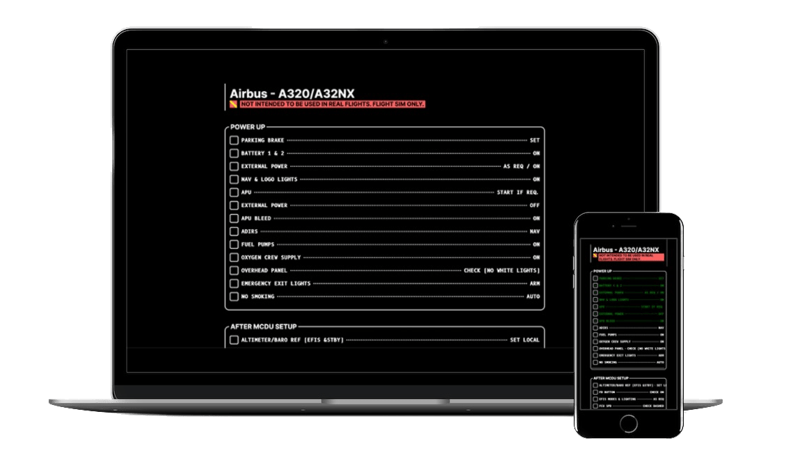

# Aircraft Checklists

 Sophisticated and highly interactive aircraft checklists for simulation purposes, utilizing exclusively frontend technologies!

# Changelog

To see the changelog [click here](https://github.com/viniciosanacleto/aircraft-checklists/blob/main/CHANGELOG.md)

## Demo
[Link](https://aircraft-checklists.vercel.app/)

## Getting Started

First, run the development server:

```bash
npm run dev
# or
yarn dev
# or
pnpm dev
```

Open [http://localhost:3000](http://localhost:3000) with your browser to see the result.

## Checklists

All the important files to the checklists are located in the folder: `src/assets/checklists`

The checklist pages are generated based on the files inside the `aircrafts` folder. They are builded using SSG during the app build time.

To create a new aircraft checklist the file should export an object implementing the interface `Checklist` located in the folder, precisely inside the `type.ts`

The next step is register the new checklist file in the `index.ts`. After this you can build the project.

```shell
yarn build
```

The result will look partially like this:

```shell
Route (app)                                Size     First Load JS
┌ ○ /                                      477 B          87.1 kB
├ ● /checklist/[id]                        1.84 kB        78.7 kB
├   ├ /checklist/cessna-152
├   ├ /checklist/cessna-citation-cj4
├   └ /checklist/airbus-a320-a32nx

...

○  (Static)  automatically rendered as static HTML (uses no initial props)
●  (SSG)     automatically generated as static HTML + JSON (uses getStaticProps)
```